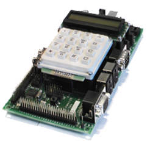

# Archiv projektu FITkit
__Tento repozitář představuje archiv projektu FITkit__
Tento projekt byl v roce 2021 ukončen, Ačkoliv po hardvérové stránce to byl stále štramák, pomyslným hřebíčkem do rakve se stalo softwarové vybavení jehož podpora byla ze strany výrobce (tehdy ještě Xilinx) ukončena a nutila nás trpět více a více zastaralý OS ve Vboxu.

Chcete-li si připomenout šťastné i chmurné okamžiky spojené s touto unikátní výukovou platformou, je možné se [vrátit v čase](https://web.archive.org/web/20221205070202/merlin.fit.vutbr.cz/FITkit/).

## Co zde najdete
1. Celkový repozitář všech [navržených projektů](trunk/apps/)
1. [Bázové designy](trunk/fpga/) umožňující např ovládání VGA výstupu a podobně
1. [Starou kostru projektu do IVH](ivh-proj) - ovládání výstupu. To by pro vás mohl být startovací bod pro tvorbu vlastního HW pokud fitkit máte.

## Co byl FITkit
Fakulta informačních technologií (FIT) Vysokého učení technického v Brně je, na rozdíl od univerzitně zaměřených fakult, technicky orientovanou školou. Je zřejmé, že výuka technických kurzů musí být směrována jak teoreticky, tak prakticky. Cílem nasazení platformy FITkit do výuky na FIT je umožnit studentům, aby mohli navrhovat a prakticky realizovat nejen softwarové, ale také hardwarové projekty či dokonce celé aplikace.

Platforma FITkit umožňuje obsáhnout značnou část spektra znalostí a dovedností, které musí dnešní inženýr – informatik znát, aby byl schopen obstát na globálním trhu práce. Typickým příkladem využití informatiky v praxi jsou tzv. vestavěné systémy (anglicky Embedded Systems), které se v dnešní době dominantně uplatňují v běžném životě a jejichž význam ještě výrazně poroste. Jednoduše řečeno se jedná o veškerá zařízení, která v sobě mají nějakým způsobem vestavěn počítač (mobilní telefon, MP3 přehrávač, televizní přijímač atd.). Typické vestavěné systémy se skládají z procesorů, specializovaného hardwaru (např. MP3 kodér/dekodér) a aplikačního software. To znamená, že je třeba umět a prakticky využívat znalosti nejen z oblasti čistě softwarových oborů, ale též z oblasti hardwaru.

### FITkit
FITkit je samostatný hardware, který obsahuje výkonný mikrokontrolér s nízkým příkonem, hradlové pole FPGA (anglicky Field Programmable Gate Array) a řadu periferií. Důležitým aspektem je využití pokročilého reprogramovatelného hardwaru na bázi hradlových polí FPGA jenž lze, podobně jako software na počítači, neomezeně modifikovat pro různé účely dle potřeby – uživatel tedy nemusí vytvářet nový hardware pro každou aplikaci znovu.

Při návrhu aplikací se využívá skutečnosti, že vlastnosti hardwaru se v dnešní době převážně popisují vhodným programovacím jazykem (např. VHDL), díky čemuž se návrh softwaru a hardwaru provádí do značné míry obdobně. Student se tedy nemusí hardwaru bát, naopak, může jej s výhodou ve svých aplikacích využít. Generování programovacích dat pro FPGA z popisu v jazyce VHDL probíhá zcela automaticky pomocí profesionálních návrhových systémů. Veškerý potřebný návrhový software je k dispozici zdarma.

Software po mikrokontroler se tvoří v jazyce C a do spustitelné formy se překládá pomocí GNU překladače, který je možné používat zdarma.

### Cíle projektu
Cílem je, aby každý student měl FITkit k dispozici a aby s ním mohl pracovat ve škole, doma i na kolejích. Důležité je, že FITkit bude využíván ve výuce řady kurzů a studenta bude provázet po celou dobu studia napříč bakalářským i magisterským studijním programem. Znalosti, získané ve výuce, pak bude moci využít pro tvorbu ročníkových, semestrálních a diplomových prací. Výsledkem by měla být výrazná podpora výuky technologií hardware a software výpočetních systémů s důrazem na praktické aplikační výstupy s tím, že výsledky budou zpřístupněny a využitelné pro co nejširší okruh zájemců nejen z řad studentů informatiky.

Iniciativa je koncipována jako open-source (pro software) a open-core (pro hardware), což znamená, že veškeré výsledky práce studentů s platformou FITkit jsou přístupné na internetu ve zdrojové formě pro kohokoli. Cílem tohoto konceptu je nastartovat synergický efekt, kdy každý, kdo využije výsledky práce vytvořené uživateli platformu FITkit, bude je dále poskytovat ve zdrojové formě a umožní tím jejich použití pro všechny zájemce jak z řad studentů FIT, tak studentů z jiných škol či odborné veřejnosti. V současné době jsme dosáhli díky vývoji vlastní open-source aplikace QDevKit stavu, kdy existuje jednotné multiplatformní prostředí a uživatelé mohou pohodlně pracovat ve Windows i v Linuxu.

### Jak začít
Nejjednodušší cesta jak FITkit vyzkoušet je nainstalovat aplikaci QDevKit včetně všech závislostí, po spuštění stáhnout aktuální verzi SVN stromu a dvojklikem v seznamu aplikací jednoduše naprogramovat FITkit zvolenou aplikací.

## Programování
Na programování je nutné nainstalovan Xilinx ISE a použít nahrávací nástroj. Detaily hledejte v [ivh-proj](ivh-proj/)